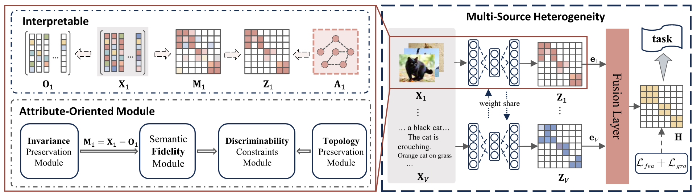

<h2 align="center"> <a href="https://ieeexplore.ieee.org/abstract/document/11219320"> Be Reliable: An Interpretable Attribute-Oriented Representation Learning Framework</a></h2>

<div align="center">

**Zihan Fang<sup>1,2</sup>, Shide Du<sup>1,2</sup>, Ying Zou<sup>1,2</sup>, Yanchao Tan<sup>1,2</sup>, Na Song<sup>3,4</sup>, Shiping Wang<sup>1,2</sup>**

<sup>1</sup>College of Computer and Data Science, Fuzhou University, Fuzhou 350108, China<br>
<sup>2</sup>Key Laboratory of Intelligent Metro, Fujian Province University, Fuzhou 350108, China<br>
<sup>3</sup>College of Artificial Intelligence, Putian University, Putian 351100, China <br>
<sup>4</sup>School of Information and Communication Engineering, Hainan University, Haikou 570228, China <br>
</div>

## Abstract
Representation learning techniques effectively unveil latent patterns within raw data. However, the learning process is often marred by uncertainties, such as variations in data quality and heterogeneous scenarios, which greatly affect the reliability of representation learning. In this article, we introduce a reliable representation learning framework to establish a connection between data attributes and modeling strategies, namely the interpretable attribute-oriented representation learning framework. First, by focusing on the inherent knowledge embedded in the data, we decouple it into four principal attributes: fidelity, topology, invariance, and discriminability. To explicitly address these attributes, we incorporate them into an optimization-derived framework using corresponding general loss terms. Furthermore, by treating the iterative solution process as a bridge, each derived network module possesses traceable interpretability, thus laying a reliable foundation. Ultimately, we extend the proposed framework to multisource heterogeneous scenarios, enabling it to adapt to complex environments while maintaining reliability. In essence, our work aims to seamlessly integrate deep representations with prior knowledge during the learning process, thereby creating a solid basis for dependable modeling. Networks derived from the proposed framework achieve promising results, particularly in complex multisource heterogeneous environments, demonstrating both their effectiveness and reliability.

## Model Architecture
<div align="center">
  
</div>

## Experiment

### Overview

This repository contains the implementation of four variants: DRLNet, GSpNet, Hyp-DRLNet, Hyp-GSpNet.
The framework is designed for robust and generalizable node clustering across various graph datasets.

### Configuration

All hyperparameters, including the number of layers and other model-specific settings, are defined in the `config` directory:

- `layer.yaml`: Specifies the number of layers.

### Datasets

The datasets used in our experiments include **Chameleon**, **Squirrel**, **Film**, **Wiki**, **Texas**, and **Wisconsin**. Please place all dataset files in the `data` directory.

| Datasets   | # Samples | # Edges | # Features | # Classes |
|------------|-----------|---------|------------|-----------|
| Chameleon  | 2,277     | 36,101  | 2,325      | 5         |
| Film       | 7,600     | 33,544  | 932        | 5         |
| Squirrel   | 5,201     | 217,073 | 2,089      | 5         |
| Texas      | 183       | 309     | 1,703      | 5         |
| Wiki       | 2,405     | 17,981  | 4,973      | 17        |
| Wisconsin  | 251       | 499     | 1,703      | 5         |


You can download the datasets from the following [Google Drive link](https://drive.google.com/drive/folders/1DQnq850E5xl_PDpV7XR_H904GxRFEW1K).

### Running the Code

To run the four model variants, use the following commands:

```bash
python cluster_DRLNet.py         # DRLNet: Denoising Representation Learning Network
python cluster_GSpNet.py         # GSpNet: Group Sparsity-enhanced Denoising Network
python cluster_Hyp-DRLNet.py     # Hyp-DRLNet: Hypergraph-guided Denoising Network
python cluster_Hyp-GSpNet.py     # Hyp-GSpNet: Group Sparsity-enhanced Hypergraph-guided Denoising Network
```


## Reference

If you find our work useful in your research, please consider citing:

```latex
@ARTICLE{11219320,
  author={Fang, Zihan and Du, Shide and Zou, Ying and Tan, Yanchao and Song, Na and Wang, Shiping},
  journal={IEEE Transactions on Neural Networks and Learning Systems}, 
  title={Be Reliable: An Interpretable Attribute-Oriented Representation Learning Framework}, 
  year={2025},
  volume={},
  number={},
  pages={1-15},
}
```
